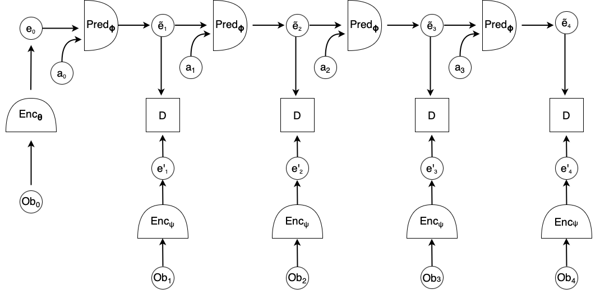

# CSCI-GA 2572 Final Project

## Overview

In this project, you will train a JEPA world model on a set of pre-collected trajectories from a toy environment involving an agent in two rooms.

### JEPA
Joint embedding prediction architecture (JEPA) is an energy based architecture for self supervised learning first proposed by [LeCun (2022)](https://openreview.net/pdf?id=BZ5a1r-kVsf). Essentially, it works by asking the model to predict its own representations of future observations.

More formally, in the context of this problem, given agent trajectory $(obs_0, action_0, obs_1, action_1, ..., obs_{h-1}, action_{h-1}, obs_h)$, we specify a recurrent JEPA architecture as


<div align="center">
  
</div>

Where $\tilde{e}_t$ is the predicted representation at timestep $t$, and $e_t$ is the encoder output at timestep $t$.

The architecture may also be teacher-forcing (non-recurrent):


<div align="center">
  
</div>


The JEPA training objective would be to minimize the distance between predicted representation $\tilde{e_t}$ and the target representation $\bar{e_t}$, where:

<div align="center">
  
</div>


Where the Target Encoder $\text{Enc}_\psi$ may be identical to Encoder $\text{Enc}_{\theta}$ ([VicReg](https://arxiv.org/pdf/2105.04906), [Barlow Twins](https://arxiv.org/pdf/2103.03230)), or not ([BYOL](https://arxiv.org/pdf/2006.07733))

$d(x, y)$ is some distance function. However, minimizing the above objective naively is problematic because it can lead to representation collapse (why?). There are techniques (such as ones mentioned above) to prevent this collapse by adding additional objectives or specific architectural choices. Feel free to experiment.

Here's a diagram illustrating a recurrent JEPA for 4 timesteps:



### Environment / Dataset
The dataset consists of random trajectories collected from a toy environment consisting of an agent (dot) in two rooms separated by a wall. There's a door in a wall.  The agent cannot travel through the border wall or middle wall (except through the door). Different trajectories may have different wall and door positions. Thus your JEPA model needs to be able to perceive and distinguish environment layouts. Two training trajectories with different layouts are depicted below.


### Task
Your task is to implement and train a JEPA architecture on a dataset of 2.5M frames of exploratory trajectories (see images above). Then, your model will be evaluated based on how well the predicted representations will capture the true (x, y) coordinate of the agent. 

Here are the constraints:
* It has to be a JEPA architecture - namely you have to train it by minimizing the distance between predictions and targets in the *representation space*, while preventing collapse.
* You can try various methods of preventing collapse, **except** image reconstruction. That is - you cannot reconstruct target images as a part of your objective, such as in the case of [MAE](https://arxiv.org/pdf/2111.06377).
* You have to rely only on the provided data in folder `/scratch/DL24FA/train`. However you are allowed to apply image augmentation.

**Failing to meet the above constraints will result in deducted points or even zero points**

### Evaluation
How do we evaluate the quality of our encoded and predicted representations?

One way to do it is through probing - we can see how well we can extract certain ground truth informations from the learned representations. In this particular setting, we will unroll the JEPA world model recurrently $N$ times into the future, conditioned on initial observation $obs_0$ and action sequence $a_0, a_1, ..., a_{N-1}$ (same process as recurrent JEPA described earlier), generating predicted representations $\tilde{e_1}, \tilde{e_2}, \tilde{e_3}, ..., \tilde{e_N}$. Then, we will train a 2-layer FC to extract the ground truth agent (x,y) coordinates from these predicted representations:

$$
\text{min } \sum_{t=1}^{N} \| \text{Prober}(\tilde{e}_t) - (x,y)_t\|_2^2
$$

The smaller the MSE loss on the probing validation dataset, the better our learned representations are at capturing the particular information we care about - in this case the agent location. (We can also probe for other things such as wall or door locations, but we only focus on agent location here).

The evaluation code is already implemented, so you just need to plug in your trained model to run it.

The evaluation script will train the prober on 170k frames of agent trajectories loaded from folder `/scratch/DL24FA/probe_normal/train`, and evaluate it on validation sets to report the mean-squared error between probed and true global agent coordinates. There will be two *known* validation sets loaded from folders `/scratch/DL24FA/probe_normal/val` and `/scratch/DL24FA/probe_wall/val`. The first validation set contains similar trajectories from the training set, while the second consists of trajectories with agent running straight towards the wall and sometimes door, this tests how well your model is able to learn the dynamics of stopping at the wall.

There are two other validation sets that are not released but will be used to test how good your model is for long-horizon predictions, and how well your model generalize to unseen novel layouts (detail: during training we exclude the wall from showing up at certain range of x-axes, we want to see how well your model performs when the wall is placed at those x-axes).


### Competition criteria
Each team will be evaluated on 5 criterias:

1. MSE error on `probe_normal`. **Weight** 1
2. MSE error on `probe_wall`. **Weight** 1
3. MSE error on long horizon probing test. **Weight** 1
4. MSE error on out of domain wall probing test. **Weight** 1
5. Parameter count of your model (less parameters --> more points). **Weight** 0.25

The teams are first ranked according to each criteria independently. A particular team's overall ranking is the weighted sum of the 5 rankings:

$$
\text{Rank}_{\text{overall}} = \sum_i^5 \text{Rank}^i * \text{weight}^i
$$


## Instructions

### Set Up

1. Follow [instruction](https://colab.research.google.com/drive/1OSj-Iyh9S91m4THjGsjf2wXkjmMnk4dx?usp=sharing) to set up HPC and singularity
2. Clone repo, `cd` into repo
3. `pip install -r requirements.txt`

### Dataset
The training data can be found in `/scratch/DL24FA/train/states.npy` and `/scratch/DL24FA/train/actions.npy`. States have shape (num_trajectories, trajectory_length, 2, 64, 64). The observation is a two-channel image. 1st channel representing agent, and 2nd channel representing border and walls.
Actions have shape (num_trajectories, trajectory_length-1, 2), each action is a (delta x, delta y) vector specifying position shift from previous global position of agent. 

Probing train dataset can be found in `/scratch/DL24FA/probe_normal/train`.

Probing val datasets can be found in `/scratch/DL24FA/probe_normal/val` and `/scratch/DL24FA/probe_wall/val`

### Training
Please implement your own training script and model architecture as a part of this existing codebase.

### Evaluation
The probing evaluation is already implemented for you. It's inside `main.py`. You just need to add change some code marked by #TODOs, namely initialize, load your model. You can also change how your model handle forward pass marked by #TODOs inside `evaluator.py`. **DO NOT** change any other parts of `main.py` and `evaluator.py`.

Just run `python main.py` to evaluate your model. 

### Submission
Create the zipped version of following folder for submission:

```
DL_Final_Proj/    
├── main.py    
├── evaluator.py    
├── ... (other files including your new ones)    
├── model_weights.pth    
└── team_name.txt  
```

Make sure `main.py` is runnable with your trained model, including python command load your model weights. 

team_name.txt contains the name of your team and members' NETIDs.

Upload the zipped file to cloud storage and email the download link to TA wz1232@nyu.edu with subject line **"DL Final Project Submission. {Team Name}"**. The TA should be able to run `wget {link}`, unzip the folder, and run `python main.py` to get validation results. Failing to do so will result in substracted scores or even zero points. 

**Submission deadline is 12/15**. Winners will be picked and asked to present their work on last class day 12/18.